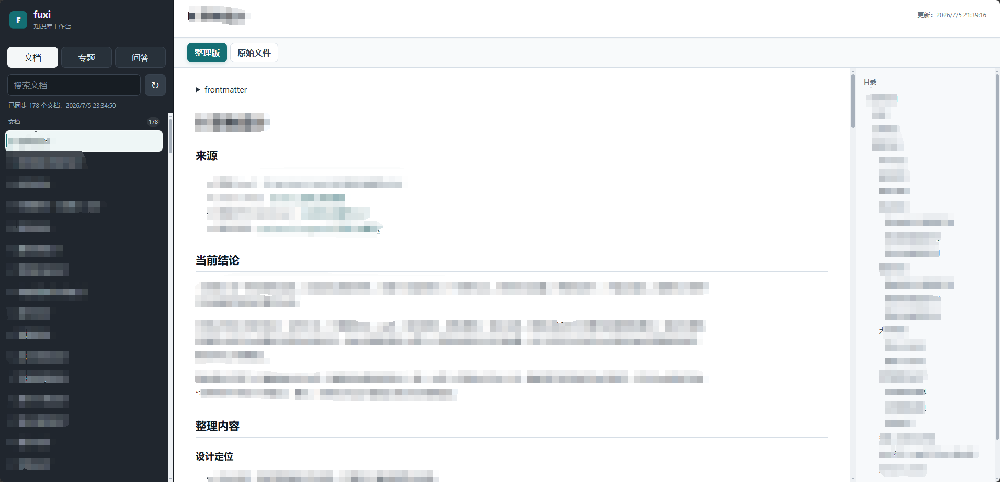
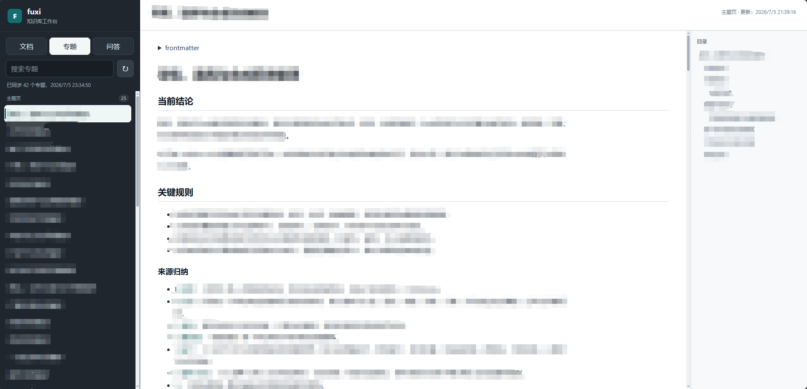
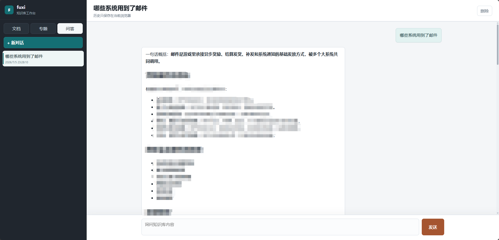

# fuxi-web-console

`fuxi-web-console` 是一个独立的知识库网页工作台，用来浏览本地 Markdown 知识库，并通过后端调用大模型完成问答。

项目本身不包含知识库内容，也不把知识库打进代码仓库。运行时通过 `KB_ROOT` 指向外部 `knowledge-base` 目录。

## 界面预览

以下截图已做模糊脱敏处理，仅展示布局与交互形态。







## 功能

- 文档浏览：展示整理版 Markdown 和原始带图 Markdown。
- 专题页：展示往回编织后的主题页、实体页。
- 问答：ChatGPT 风格界面，后端读取知识库并调用 OpenAI-compatible API。
- 本地历史：对话历史保存在当前浏览器 `localStorage`。
- 知识库刷新：知识库文件变化后，可在网页中刷新目录。
- 移动端适配：手机端使用抽屉式目录。

## 目录关系

推荐把网站和知识库作为两个独立目录放在同一级：

```text
fuxi/
  fuxi-web-console/
  ai-lib/
    knowledge-base/
```

网站默认读取：

```text
../ai-lib/knowledge-base
```

如果你的知识库放在其他位置，请修改 `.env.local` 或 Docker 的 `.env`。

## 知识库目录要求

默认配置会读取以下目录：

```text
knowledge-base/wiki/imported-excel
knowledge-base/raw/excel-md-with-images
knowledge-base/raw/excel-images
knowledge-base/wiki/topics
knowledge-base/wiki/entities
```

路径配置文件在：

```text
server/config/kb.paths.example.json
```

如果需要自定义路径，复制一份本地配置：

```bash
cp server/config/kb.paths.example.json server/config/kb.paths.local.json
```

`server/config/kb.paths.local.json` 已被 `.gitignore` 排除，不应提交到仓库。

## 普通 Node 安装

要求：

- Node.js 18+

启动步骤：

```bash
git clone https://github.com/LiZhiWeiGZ/fuxi-web-console.git
cd fuxi-web-console
cp .env.example .env.local
cp server/config/model.config.example.json server/config/model.config.local.json
```

编辑 `.env.local`：

```env
HOST=127.0.0.1
PORT=5177
KB_PROJECT_ROOT=../ai-lib
KB_ROOT=../ai-lib/knowledge-base
BASIC_AUTH=
```

编辑 `server/config/model.config.local.json`，填写大模型配置。

启动：

```bash
npm start
```

默认访问：

```text
http://127.0.0.1:5177
```

## Docker 安装

要求：

- Docker
- Docker Compose v2，或旧版 `docker-compose`

推荐目录：

```text
/opt/fuxi/
  fuxi-web-console/
  ai-lib/
    knowledge-base/
```

启动步骤：

```bash
cd /opt/fuxi/fuxi-web-console
cp .env.docker.example .env
cp server/config/model.config.example.json server/config/model.config.local.json
```

编辑 `.env`：

```env
BIND_ADDR=0.0.0.0
PUBLIC_PORT=5177
KB_ROOT_HOST=/opt/fuxi/ai-lib/knowledge-base
BASIC_AUTH=admin:change-this-password
```

启动：

```bash
docker compose up -d --build
```

如果服务器是旧版 Compose：

```bash
docker-compose up -d --build
```

## 安全说明

- 不要提交 `server/config/model.config.local.json`，里面会包含 API Key。
- 公网部署建议开启 `BASIC_AUTH`。
- 公网访问建议配置 HTTPS，否则 Basic Auth、聊天内容和知识库内容会明文传输。
- 如果通过 Nginx/Caddy/宝塔反代，请确认 `Authorization` 请求头会转发到后端。

## 常用命令

检查语法：

```bash
npm run check
```

健康检查：

```bash
curl http://127.0.0.1:5177/api/health
```

如果开启了 Basic Auth：

```bash
curl -u admin:change-this-password http://127.0.0.1:5177/api/health
```

## 打包发布

Windows 本地可以用内置脚本生成部署目录：

```powershell
.\deploy\pack-deploy.ps1
```

默认只打包网站代码和示例配置，不会复制：

```text
.env
.env.local
server/config/model.config.local.json
server/config/kb.paths.local.json
```

如果确实需要把知识库一起放进部署目录，可以显式指定：

```powershell
.\deploy\pack-deploy.ps1 -IncludeKnowledgeBase -KnowledgeBasePath "..\ai-lib\knowledge-base"
```

## 上传 GitHub 前检查

确认以下文件不要提交：

```text
.env
.env.local
server/config/model.config.local.json
server/config/kb.paths.local.json
logs/
node_modules/
```

可以执行：

```bash
git status --short
```

确认没有本地密钥、知识库正文大文件或日志被加入仓库。

## 详细部署

更多 VPS 部署说明见 [DEPLOY.md](DEPLOY.md)。
